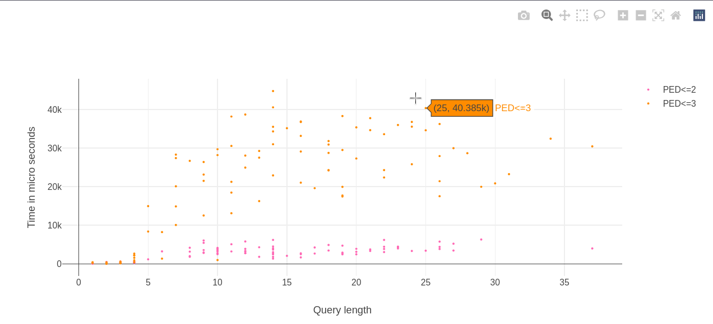
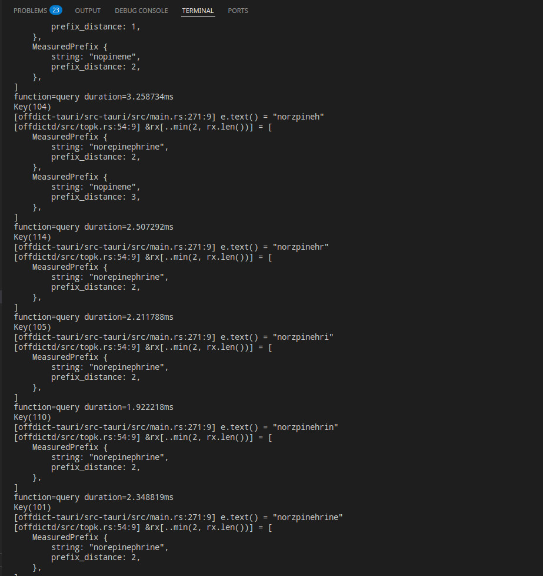
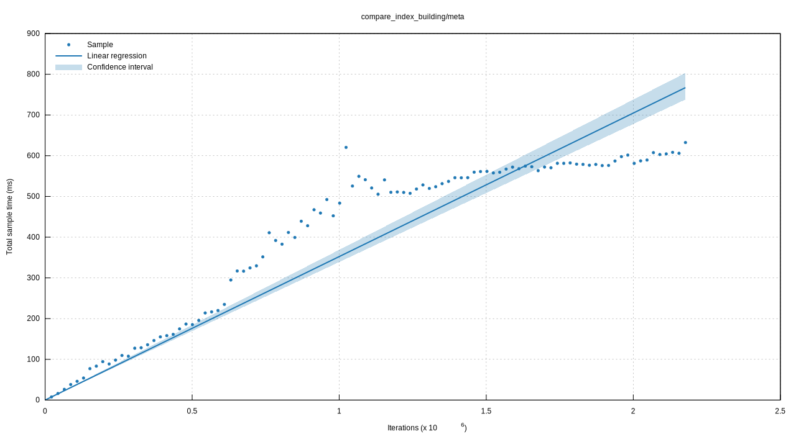

# Matching-based Instant Prefix Fuzzy Autocompletion

See [math](./topk_search.typ) in Typst.

The time complexity is dependent on the active matching set, and the size of tree overall, which doesn't explode as you type in longer strings.

`PED <= 3` is the common and reasonabnle parameter for fuzzy autocompletion.

At this parameter, META outperforms the common FST autocompletion algorithm used in non-commercial softwares, by 5x. (avg. 16ms for META, 85ms for FST), *on average*. 

___META performs well with long queries___, when many other algorithms come with penalty as the query string increases in length.

___META is correct___, meaning all possible matching results are returned.

There are only *exact prefix search* and *fuzzy search* available non-commercially, which for SOTA, are released by https://github.com/wolfgarbe 

This algorithm deals with the *prefix fuzzy search* problem, which competes with the commercial SOTA.

The algorithm was originally intended for my daily driver offline dictionary [offdict](https://github.com/ple1n/offdict/) with 1.4M words indexed, which works perfectly.

## Lookup time does not explode



[plot](./docs/ped3.html)

## This is the norm, not a cherry-pick



Average user experience with [offdict](https://github.com/ple1n/offdict/) on a linux machine.

## Benchmark with Criterion


PED of 3 is enough for most autocompletion use cases, which as the graphs shows, usually completes within 20ms.

For comparison, the best former opensource implemenation is based on Levenshtein Finite State Automata. 


Indexing is both linear to META autocompletion and FST


Indexing with 1.4M unique words that are repeated to expand to up to 2M, takes 600ms




## Benchmark reports

- https://ple1n.github.io/strprox/fst_varied_ed/ped_bounded/4/report/index.html
- https://ple1n.github.io/strprox/fst_varied_ed/ped_bounded/3/report/index.html
- https://ple1n.github.io/strprox/fst_varied_ed/ped_bounded/2/report/index.html
- https://ple1n.github.io/strprox/fst_varied_ed/ped_bounded/1/report/index.html
- https://ple1n.github.io/strprox/fst_varied_ed/ped_bounded/report/index.html
- https://ple1n.github.io/strprox/fst_varied_ed/report/index.html
- https://ple1n.github.io/strprox/compare_index_building/meta/report/index.html
- https://ple1n.github.io/strprox/compare_index_building/fst/report/index.html
- https://ple1n.github.io/strprox/compare_index_building/report/index.html
- https://ple1n.github.io/strprox/meta_varied_ed/ped_bounded/4/report/index.html
- https://ple1n.github.io/strprox/meta_varied_ed/ped_bounded/3/report/index.html
- https://ple1n.github.io/strprox/meta_varied_ed/ped_bounded/2/report/index.html
- https://ple1n.github.io/strprox/meta_varied_ed/ped_bounded/1/report/index.html
- https://ple1n.github.io/strprox/meta_varied_ed/ped_bounded/report/index.html
- https://ple1n.github.io/strprox/meta_varied_ed/report/index.html

## Testing 

Tracing flags from `INFO` to `TRACING` can enable code paths for self verification during algorithm execution.

Example runs

```
warning: `strprox` (lib test) generated 21 warnings (run `cargo fix --lib -p strprox --tests` to apply 5 suggestions)
    Finished `test` profile [optimized + debuginfo] target(s) in 7.12s
     Running unittests src/lib.rs (target/debug/deps/strprox-4173846f43ac9c14)

running 1 test
 INFO vapour return >1> Zvapour retur, vapour return, 1
 INFO 轘 >0> 轘, 轘, 0
 INFO concrete-lined canal >1> concrete-lzned canal, concrete-lined canal, 1
 INFO track-type tractor >0> track-type tractor, track-type tractor, 0
 INFO Arrhenius theory of dissociation >1> Arrhenius theory oaf dissociation, Arrhenius theory of dissociation, 1
 INFO ovenbird >1> ovnnbird, ovenbird, 1
 INFO 他侬 >1> 他r, 他, 1
 INFO 秦梁 >0> 秦梁, 秦梁, 0
 INFO hymenopter >0> hymenopter, hymenopter, 0
 INFO be offended at >1> be offendedt, be offended at, 1
 INFO sweeping machine >0> sweeping machine, sweeping machine, 0
 INFO centum >0> centum, centum, 0
 INFO weight parameter >1> weight puarameter, weight parameter, 1
 INFO record access mode >0> record access mode, record access mode, 0
 INFO 金屋娇娘 >1> 屋娇娘, 唤娇娘, 1
 INFO local variable >2> local v9rilable, local variable, 2
 INFO sojourner >0> sojourner, sojourner, 0
 INFO abrasive jet cleaning >2> abrasiv jet 8leaning, abrasive jet cleaning, 2
 INFO 仁皇 >0> 仁皇, 仁皇, 0
 INFO cab brace >1> cb brace, cab brace, 1
 INFO beater-refiner >1> bveater-refiner, beater-refiner, 1
 INFO 贯朽粟陈 >1> 朽粟陈, 朽陈, 1
 INFO 区闻陬见 >1> S闻陬见, 区闻陬见, 1
 INFO inexorable law >2> ineorableU law, inexorable law, 2
 INFO mark contact >2> mark conOct, mark contact, 2
 INFO acoasm >1> acosm, acosmia, 0
 INFO 宪批 >1> 批, 批, 0
 INFO zero-deviation situation >1> zero-dTeviation situation, zero-deviation situation, 1
 INFO index card >1> indSex card, index card, 1
 INFO 曙鼓 >0> 曙鼓, 曙鼓, 0
 INFO hybrid micro circuit >0> hybrid micro circuit, hybrid micro circuit, 0
 INFO 明确 >0> 明确, 明确, 0
 INFO hyperposia >2> hypekosia, hyperoside, 2
 INFO left residue class >2> left residub cass, left residue class, 2
 INFO graduated rate schedule >0> graduated rate schedule, graduated rate schedule, 0
 INFO Canales palatini minores >0> Canales palatini minores, Canales palatini minores, 0
 INFO Jack Robinson >0> Jack Robinson, Jack Robinson, 0
 INFO scamper off >0> scamper off, scamper off, 0
 INFO chondrogenetic >2> choRndrgenetic, chondrogenetic, 2
 INFO single instruction stream single data stream >2> sinfle instruction stram single data stream, single instruction stream single data stream, 2
 INFO 儒宗 >1> h宗, h, 1
 INFO addressing >2> admdrssing, addressing, 2
 INFO antijump baffle >0> antijump baffle, antijump baffle, 0
 INFO turning shovel >0> turning shovel, turning shovel, 0
 INFO subgrade squeeze-out >0> subgrade squeeze-out, subgrade squeeze-out, 0
 INFO quantum-mechanical memory machine >2> quanStuNm-mechanical memory machine, quantum-mechanical memory machine, 2
 INFO subsidiary rod >2> subsMdTary rod, subsidiary rod, 2
 INFO semi-liquid phase process >0> semi-liquid phase process, semi-liquid phase process, 0
 INFO noise trap >0> noise trap, noise trap, 0
 INFO 殿阙 >2> 殿Nc, Ncctuidae, 1
 INFO shock absorber function >1> shock absorber4function, shock absorber function, 1
 INFO coconut capacitor >0> coconut capacitor, coconut capacitor, 0
 INFO servo-control mechanism >0> servo-control mechanism, servo-control mechanism, 0
 INFO 蚕箪 >0> 蚕箪, 蚕箪, 0
 INFO versin >0> versin, versin, 0
 INFO pterygopalatine fossa >0> pterygopalatine fossa, pterygopalatine fossa, 0
 INFO swamp with >2> s7warmp with, swamp with, 2
 INFO cold junction temperature >2> old junction emperature, cold junction temperature, 2
 INFO matured dough >1> matured tdough, matured dough, 1
 INFO electric spark >1> el9ctric spark, electric spark, 1
 INFO authority for the report >0> authority for the report, authority for the report, 0
 INFO 素辉 >0> , 'd, 0
 INFO nephrocapsectomy >0> nephrocapsectomy, nephrocapsectomy, 0
 INFO 累心 >1> 累g心, 累心, 1
 INFO 笃瘵 >1> 瘵, 瘵, 0
 INFO sporogenous yeasts >0> sporogenous yeasts, sporogenous yeasts, 0
 INFO optical dividing head >1> optical dividBng head, optical dividing head, 1
 INFO projection comparator >2> proIjection compaator, projection comparator, 2
 INFO secondary sun wheel >1> secondary sun whel, secondary sun wheel, 1
 INFO inutile >0> inutile, inutile, 0
 INFO 牛头阿傍 >1> 牛头Z, 牛头, 1
 INFO hemoplastic >0> hemoplastic, hemoplastic, 0
 INFO ooecial vesicle >0> ooecial vesicle, ooecial vesicle, 0
 INFO double-crank press >1> douWle-crank press, double-crank press, 1
 INFO straightway pump >2> strad1ghtway pump, straightway pump, 2
 INFO 月灵 >1> d灵, d, 1
 INFO 幸恩 >0> , 'd, 0
 INFO 朝聘 >1> 聘, 聘, 0
 INFO service channel >0> service channel, service channel, 0
 INFO muscle of mastication >0> muscle of mastication, muscle of mastication, 0
 INFO efficiency >0> efficiency, efficiency, 0
 INFO reflecting square >1> reflectin square, reflecting square, 1
 INFO 鼻头出火 >2> 鼻Om头出火, 鼻头出火, 2
 INFO 悦乐 >0> 悦乐, 悦乐, 0
 INFO shadow microdiffraction >0> shadow microdiffraction, shadow microdiffraction, 0
 INFO alternate month >2> alternae onth, alternate month, 2
 INFO wedge clip >0> wedge clip, wedge clip, 0
 INFO CATB >2> CZAUB, CAU, 2
 INFO 帆布潜鸭 >1> 帆布鸭, 帆布, 1
 INFO file organization >0> file organization, file organization, 0
 INFO naphtha gas reversion >0> naphtha gas reversion, naphtha gas reversion, 0
 INFO grillroom >2> rillrom, Billroth Ⅰ anastomosis, 2
 INFO -ridden >2> -rsddLen, -ridden, 2
 INFO spellable >2> spLeQllable, spellable, 2
 INFO heavy pumping >0> heavy pumping, heavy pumping, 0
 INFO soda glass >0> soda glass, soda glass, 0
 INFO paludament >1> paludaent, paludament, 1
 INFO assignable instrument >1> assigEnable instrument, assignable instrument, 1
 INFO external taper turning >2> external aper turniAng, external taper turning, 2
 INFO pretend to >0> pretend to, pretend to, 0
 WARN Total words 1442910
 WARN Average time per query: 2.41 ms. Failed 0/100. Max ED searched 2. Total time: 0s. PED: [49, 29, 22]. PED_Given [45, 32, 23]
test tests::generic::meta::words_bounded_peds ... ok

successes:

---- tests::generic::meta::words_bounded_peds stdout ----
[src/tests/mod.rs:355:9] cases = []

running 1 test
 WARN Total words 1442910
 WARN Average time per query: 0.13052 ms. Failed 0/100000. Max ed searched 1. Total time: 13s. PED: [55444, 44556]. PED_Given [53247, 46753]
 WARN Total words 1442910
 WARN Average time per query: 1.9838 ms. Failed 0/10000. Max ed searched 2. Total time: 19s. PED: [4054, 3580, 2366]. PED_Given [3734, 3682, 2584]
 WARN Total words 1442910
 WARN Average time per query: 21.935 ms. Failed 0/1000. Max ed searched 3. Total time: 21s. PED: [313, 305, 238, 144]. PED_Given [265, 325, 255, 155]
test tests::generic::meta::varied_ed2 has been running for over 60 seconds
 WARN Total words 1442910
 WARN Average time per query: 124.21 ms. Failed 0/100. Max ed searched 4. Total time: 12s. PED: [31, 21, 18, 25, 5]. PED_Given [27, 18, 25, 25, 5]
test tests::generic::meta::varied_ed2 ... ok

successes:

---- tests::generic::meta::varied_ed2 stdout ----
[src/tests/mod.rs:387:9] cases = []
[src/tests/mod.rs:387:9] cases = []
[src/tests/mod.rs:387:9] cases = []
[src/tests/mod.rs:387:9] cases = []


 WARN meta Average time per query: 0 ms. Failed 0/1. Max ED searched 4. Total time: 0s. PED: [1, 0, 0, 0, 0]. PED_Given [1, 0, 0, 0, 0]
[benches/basic_meta.rs:106:9] cases = []
 WARN meta Average time per query: 0 ms. Failed 0/1. Max ED searched 4. Total time: 0s. PED: [1, 0, 0, 0, 0]. PED_Given [1, 0, 0, 0, 0]
[benches/basic_meta.rs:106:9] cases = []
 WARN meta Average time per query: 113 ms. Failed 0/1. Max ED searched 4. Total time: 0s. PED: [0, 1, 0, 0, 0]. PED_Given [0, 1, 0, 0, 0]
[benches/basic_meta.rs:106:9] cases = []
meta_varied_ed/ped_bounded/4
                        time:   [76.338 ms 88.638 ms 100.63 ms]
                        change: [−27.138% −10.438% +8.6736%] (p = 0.27 > 0.05)
                        No change in performance detected.
 WARN Total words 1442910

 WARN Total fails for META: 0

```

## Known errors

Errors have been fixed. I suspect the original paper is full of errors

## [Citations](#citations)
```bibtex
@article{10.14778/2977797.2977808,
author = {Deng, Dong and Li, Guoliang and Wen, He and Jagadish, H. V. and Feng, Jianhua},
title = {META: An Efficient Matching-Based Method for Error-Tolerant Autocompletion},
year = {2016},
issue_date = {June 2016},
publisher = {VLDB Endowment},
volume = {9},
number = {10},
issn = {2150-8097},
url = {https://doi.org/10.14778/2977797.2977808},
doi = {10.14778/2977797.2977808},
journal = {Proc. VLDB Endow.},
month = {jun},
pages = {828–839},
numpages = {12}
}
```
This paper is also available from the conference website [here](http://www.vldb.org/pvldb/vol9/p828-deng.pdf).

## [License](#license)
Dual-licensed under [MIT](LICENSE-MIT) and [Apache-2.0](LICENSE-APACHE). You may choose either license.

### [Contributions](#contrib)
Contributions to this project are likewise understood to be dual-licensed under MIT and Apache-2.0.

## Notes 

`cargo bench  --bench index -- --plotting-backend plotters` if you want to generate benchs with plotters.

Run `deno -A gen_links.ts` to update links in this file
